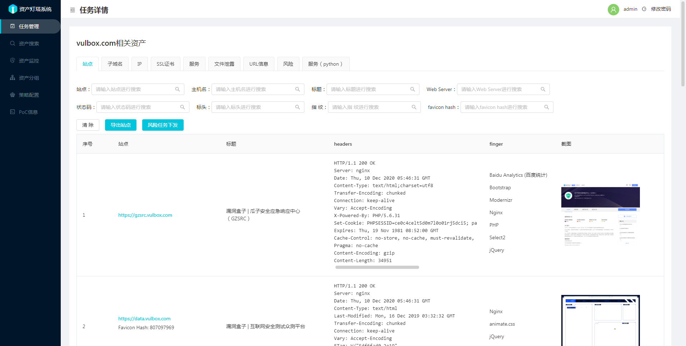

# ARL(Asset Reconnaissance Lighthouse)资产侦察灯塔系统
[](https://www.python.org/)
[](https://hub.docker.com/r/tophant/arl)
[](https://github.com/TophantTechnology/ARL/issues)
[](https://github.com/TophantTechnology/ARL/stargazers)

## 1# 注明

- **因为灯塔ARL的官方开源项目被删除了，所以建立了本开源项目留作备份，本项目所有内容均来自于[TophantTechnology/ARL](https://github.com/TophantTechnology/ARL)最新版本**
- **ARL官方开源项目关闭的具体原因请看：[https://mp.weixin.qq.com/s/hM3t3lYQVqDOlrLKz3_TSQ](https://mp.weixin.qq.com/s/hM3t3lYQVqDOlrLKz3_TSQ)**
- **ARL-NPoC（ARL核心）的最新源码备份：[https://github.com/Aabyss-Team/ARL-NPoC](https://github.com/Aabyss-Team/ARL-NPoC)**
- **arl_file（ARL相关构建）的最新备份：[https://github.com/Aabyss-Team/arl_files](https://github.com/Aabyss-Team/arl_files)**
- **在 `CentOS7/8/Rocky 8.10` 和 `Ubuntu20.04` 系统上，直接拉取运行本项目内的 `misc/setup-arl.sh` 即可安装，源码和docker安装都集成在了脚本中解放双手**
- **Docker安装感谢 [@本间白猫](https://github.com/honmashironeko) 师傅维护的Docker镜像**
- **ARL-Docker：[https://github.com/honmashironeko/ARL-docker](https://github.com/honmashironeko/ARL-docker)**
- **ARL添加指纹脚本，感谢 [@msmoshang](https://github.com/msmoshang) 对本项目和ADD-ARL-Finger项目的维护**
- **ADD-ARL-Finger：[https://github.com/msmoshang/ADD-ARL-Finger](https://github.com/msmoshang/ADD-ARL-Finger)**
- **脚本现以支持国内服务器安装建议用源码安装，Docker安装采用Docker镜像加速的方式可能会不稳定抽风现象建议源码安装**
- **去除自带指纹，转为自选添加提高脚本运行容错**
- **新增控制台**

**万分感谢以下为 ARL 后续维护和支持作出贡献的师傅们** :confetti_ball:

<table>
    <tr>
        <td align="center"><br /><a href="https://github.com/msmoshang/ADD-ARL-Finger">@msmoshang</a></td>
        <td align="center"><br /><a href="https://github.com/honmashironeko/ARL-docker">@本间白猫</a></td>
        <td align="center"><br /><a href="https://github.com/AabyssZG">@AabyssZG</a></td>
    </tr>
</table>

---

### 1.1 如何安装ARL

**ARL安装命令如下（源码安装和Docker安装合一）**

```
#国外
wget https://raw.githubusercontent.com/Aabyss-Team/ARL/master/misc/setup-arl.sh
chmod +x setup-arl.sh
./setup-arl.sh
#国内
wget https://raw.gitcode.com/msmoshang/ARL/blobs/24b06ec7efb32b9be380ab01ebf505e77c7811bf/setup-arl.sh
chmod +x setup-arl.sh
./setup-arl.sh
```

如果选择的是源码安装，可以通过以下命令确认服务状态（如果全部运行正常那就没问题）：

```
systemctl status mongod
systemctl status rabbitmq-server
systemctl status arl-web
systemctl status arl-worker
systemctl status arl-worker-github
systemctl status arl-scheduler
systemctl status nginx
```

源码安装后，请前往ARL-Web页面：`https://IP:5003/`

原账号密码：`admin`,`arlpass`

新版账号密码为随机生成，会打印在控制台

Docker安装暂时提供单个选择，如下：

```
1) honmashironeko/ARL-docker：本间白猫ARL-Docker版
```

执行完脚本确认没报错后，请前往ARL-Web页面：`https://IP:5003/`：账号：`admin`，密码：`honmashironeko`

> ~~本项目已经替换完毕：如需构建本项目，在拉取和运行脚本时，要将 `TophantTechnology/ARL` / `1c3z/ARL-NPoC` / `1c3z/arl_files` 这三个字符串替换为 `Aabyss-Team/ARL` / `Aabyss-Team/ARL-NPoC` / `Aabyss-Team/arl_files`~~

---

### 1.2 问题反馈

近期发现本项目的Issues和Bug比较多，有问题欢迎进群咨询：

<table>
  <tr>
    <td></td>
    <td></td>
  </tr>
</table>

### 1.3 万分感谢各位师傅的Star

[](https://star-history.com/#Aabyss-Team/ARL&Date)

资产灯塔，不仅仅是域名收集

## 2# 简介

旨在快速侦察与目标关联的互联网资产，构建基础资产信息库。
协助甲方安全团队或者渗透测试人员有效侦察和检索资产，发现存在的薄弱点和攻击面。

在开始使用之前，请务必阅读并同意[免责声明](Disclaimer.md)中的条款，否则请勿下载安装使用本系统。

## 3# 特性
1. 域名资产发现和整理
2. IP/IP 段资产整理
3. 端口扫描和服务识别
4. WEB 站点指纹识别
5. 资产分组管理和搜索
6. 任务策略配置
7. 计划任务和周期任务
8. Github 关键字监控
9. 域名/IP 资产监控
10. 站点变化监控
11. 文件泄漏等风险检测
12. nuclei PoC 调用
13. [WebInfoHunter](https://tophanttechnology.github.io/ARL-doc/function_desc/web_info_hunter/) 调用和监控

## 4# 系统要求

目前暂不支持Windows，初次体验可采用Docker方式运行，长期使用建议采用源码安装方式运行。系统配置建议：CPU:4线程 内存:8G 带宽:10M。  
由于自动资产发现过程中会有大量的的发包，建议采用云服务器可以带来更好的体验。


## 5# 截图

一、登录页面

默认端口5003 (https), 默认用户名密码admin/arlpass  


二、任务页面


三、子域名页面


四、站点页面



五、资产监控页面


详细说明可以参考：[资产分组和监控功能使用说明](https://github.com/TophantTechnology/ARL/wiki/%E8%B5%84%E4%BA%A7%E5%88%86%E7%BB%84%E5%92%8C%E7%9B%91%E6%8E%A7%E5%8A%9F%E8%83%BD%E4%BD%BF%E7%94%A8%E8%AF%B4%E6%98%8E)

六、策略页面


七、筛选站点进行任务下发


详细说明可以参考： [2.3-新添加功能详细说明](https://github.com/TophantTechnology/ARL/wiki/ARL-2.3-%E6%96%B0%E6%B7%BB%E5%8A%A0%E5%8A%9F%E8%83%BD%E8%AF%A6%E7%BB%86%E8%AF%B4%E6%98%8E)

八、计划任务


详细说明可以参考： [2.4.1-新添加功能详细说明](https://github.com/TophantTechnology/ARL/wiki/ARL-2.4.1-%E6%96%B0%E6%B7%BB%E5%8A%A0%E5%8A%9F%E8%83%BD%E8%AF%A6%E7%BB%86%E8%AF%B4%E6%98%8E)

九、GitHub 监控任务


## 6# 任务选项说明

| 编号 |      选项      |                                       说明                                        |
| --- | -------------- | -------------------------------------------------------------------------------- |
| 1    | 任务名称        | 任务名称                                                                          |
| 2    | 任务目标        | 任务目标，支持IP，IP段和域名。可一次性下发多个目标                                      |
| 3    | 域名爆破类型    | 对域名爆破字典大小, 大字典：常用2万字典大小。测试：少数几个字典，常用于测试功能是否正常        |
| 4    | 端口扫描类型    | ALL：全部端口，TOP1000：常用top 1000端口，TOP100：常用top 100端口，测试：少数几个端口 |
| 5    | 域名爆破        | 是否开启域名爆破                                                                   |
| 6    | DNS字典智能生成 | 根据已有的域名生成字典进行爆破                                                      |
| 7    | 域名查询插件    |  已支持的数据源为13个，`alienvault`, `certspotter`,`crtsh`,`fofa`,`hunter` 等        |
| 8    | ARL 历史查询    | 对arl历史任务结果进行查询用于本次任务                                                |
| 9    | 端口扫描        | 是否开启端口扫描，不开启站点会默认探测80,443                                         |
| 10   | 服务识别        | 是否进行服务识别，有可能会被防火墙拦截导致结果为空                                     |
| 11   | 操作系统识别    | 是否进行操作系统识别，有可能会被防火墙拦截导致结果为空                                 |
| 12   | SSL 证书获取    | 对端口进行SSL 证书获取                                                             |
| 13   | 跳过CDN       | 对判定为CDN的IP, 将不会扫描端口，并认为80，443是端口是开放的                             |
| 14   | 站点识别        | 对站点进行指纹识别                                                                 |
| 15   | 搜索引擎调用    | 利用搜索引擎搜索下发的目标爬取对应的URL和子域名                                                       |
| 16   | 站点爬虫        | 利用静态爬虫对站点进行爬取对应的URL                                                  |
| 17   | 站点截图        | 对站点首页进行截图                                                                 |
| 18   | 文件泄露        | 对站点进行文件泄露检测，会被WAF拦截                                                  |
| 19   | Host 碰撞        | 对vhost配置不当进行检测                                                |
| 20    | nuclei 调用    | 调用nuclei 默认PoC 对站点进行检测 ，会被WAF拦截，请谨慎使用该功能                |
| 21   | WIH 调用      | 调用 WebInfoHunter 工具在JS中收集域名,AK/SK等信息                     |
| 22   | WIH 监控任务   | 对资产分组中的站点周期性 调用 WebInfoHunter 工具在JS中域名等信息进行监控  |

## 7# 配置参数说明

Docker环境配置文件路径 `docker/config-docker.yaml`

|       配置        |                 说明                 |
| ----------------- | ------------------------------------ |
| CELERY.BROKER_URL | rabbitmq连接信息                      |
| MONGO             | mongo 连接信息                        |
| QUERY_PLUGIN      | 域名查询插件数据源Token 配置             |
| GEOIP             | GEOIP 数据库路径信息                  |
| FOFA              | FOFA API 配置信息                     |
| DINGDING          | 钉钉消息推送配置                     |
| EMAIL              | 邮箱发送配置                     |
| GITHUB.TOKEN      |  GITHUB 搜索 TOKEN                 |
| ARL.AUTH          | 是否开启认证，不开启有安全风险          |
| ARL.API_KEY       | arl后端API调用key，如果设置了请注意保密 |
| ARL.BLACK_IPS     | 为了防止SSRF，屏蔽的IP地址或者IP段      |
| ARL.PORT_TOP_10     | 自定义端口，对应前端端口测试选项      |
| ARL.DOMAIN_DICT     | 域名爆破字典，对应前端大字典选项      |
| ARL.FILE_LEAK_DICT     | 文件泄漏字典      |
| ARL.DOMAIN_BRUTE_CONCURRENT     | 域名爆破并发数配置      |
| ARL.ALT_DNS_CONCURRENT     | 组合生成的域名爆破并发数      |
| PROXY.HTTP_URL     | HTTP代理URL设置      |
| FEISHU | 飞书消息推送配置 |
| WXWORK | 企业微信消息推送 |


## 8# 忘记密码重置

当忘记了登录密码，可以执行下面的命令，然后使用 `admin/admin123` 就可以登录了。

### 8.1 Docker安装忘记密码

```
docker exec -ti arl_mongodb mongo -u admin -p admin
use arl
db.user.drop()
db.user.insert({ username: 'admin',  password: hex_md5('arlsalt!@#'+'admin123') })
```

### 8.2 源码安装忘记密码

```
mongo
use arl
db.user.drop()
db.user.insert({ username: 'admin',  password: hex_md5('arlsalt!@#'+'admin123') })
```

## 9# FAQ

请访问如下链接[FAQ](https://tophanttechnology.github.io/ARL-doc/faq/)

## 12# 写在最后

目前ARL仅仅只是完成了对资产的部分维度的发现和收集，自动发现过程中难免出现覆盖度不全、不精准、不合理等缺陷的地方还请反馈至我们。  
